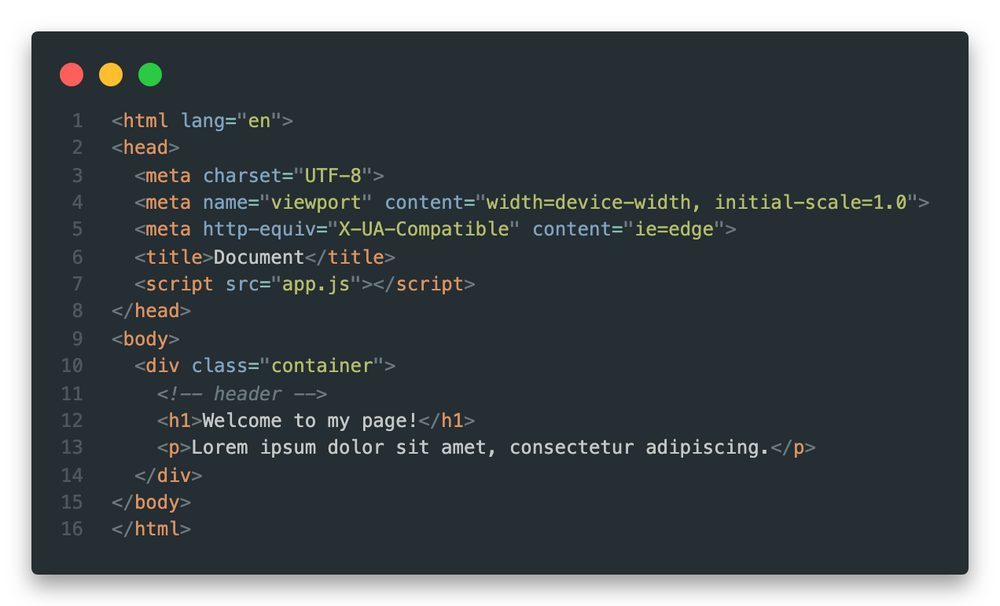
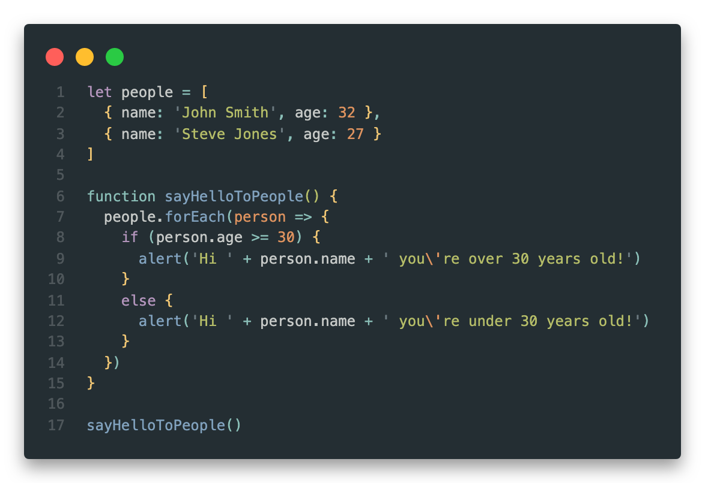

# Make Apps Theme (VSCode Theme)

A relaxed, easy-on-the-eyes theme based on the [Hybrid Next Theme](https://marketplace.visualstudio.com/items?itemName=wyze.theme-hybrid-next&ssr=false#overview).

## Screenshots

### HTML

### JavaScript

### CSS

### UI

## About This Theme

This theme is based on the [Hybrid Next Theme](https://marketplace.visualstudio.com/items?itemName=wyze.theme-hybrid-next&ssr=false#overview) by [Neil Kistner](https://github.com/wyze) which is based on the original [Hybrid Next Theme for Atom](https://github.com/kaicataldo/hybrid-next-syntax) by [Kai Cataldo](https://github.com/kaicataldo).

I've only made minor changes to the syntax highlighting, but have made many changes to the UI elements (activity bar, side bar, panels etc) to give the theme a more cohesive look & feel.

## Support

Like this theme? Please leave a review:

## Change Log

[View the Change Log here](https://github.com/dannyconnell/vscode-make-apps-theme/blob/master/CHANGELOG.md)

## Credits

- Thanks to [Neil Kistner](https://github.com/wyze) for porting the [Hybrid Next Theme](https://marketplace.visualstudio.com/items?itemName=wyze.theme-hybrid-next&ssr=false#overview) to VSCode
- Thanks to [Kai Cataldo](https://github.com/kaicataldo) for creating the original [Hybrid Next Theme for Atom](https://github.com/kaicataldo/hybrid-next-syntax)